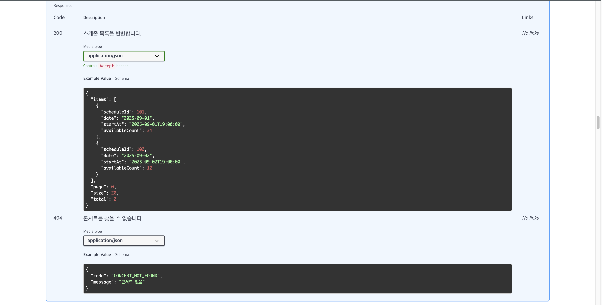

# 📘 API

## 1) 대기열 토큰 발급 — `POST /waiting/issue`
 

- `userId`를 보내면 **토큰 / 순번 / 만료시간**을 내려줍니다.  
- 헤더 `X-Queue-Position`으로 현재 순번도 같이 옵니다.  
- 잘못된 `userId`면 400 형식으로 내려갑니다.

## 2) 대기 상태 확인 — `GET /waiting/check`

- 헤더 `X-Queue-Token`을 넣고 **순번/활성 여부/예상 대기시간**을 확인합니다.  
- 토큰이 만료되면 401로 응답합니다.

## 3) 예약 가능 날짜(스케줄) — `GET /concerts/{concertId}/schedules`

- 콘서트의 스케줄을 조회합니다.  
- 기본값으로 **남은 좌석 1개 이상**인 스케줄만 반환합니다.  
- 없으면 404로 응답합니다.

## 4) 좌석 현황 — `GET /concerts/{concertId}/schedules/{scheduleId}/seats`

- 좌석 번호는 **1~50**입니다.  
- 좌석 상태는 `AVAILABLE / TEMP_RESERVED(임시 배정) / RESERVED(확정)` 입니다.  
- 스케줄이 없으면 404로 응답합니다.

## 5) 좌석 예약(임시 배정) — `POST /reservations`

- 바디: `userId / concertId / scheduleId / seatNumber`  
- 헤더: **Idempotency-Key(필수)**  
- 성공 시 좌석은 **ON_HOLD(기본 5분)** 상태가 되고 `holdExpiresAt`이 내려옵니다.  
- 이미 잡힌 좌석이면 **409**로 응답합니다.

## 6) 예약 상태 조회 — `GET /reservations/{reservationId}`

- 예약 상세를 조회합니다.  
- 예시 응답 필드: `reservationId, scheduleId, seatNumber, status, holdExpiresAt, price`  
- 없으면 404.

## 7) 잔액 조회 — `GET /users/{userId}/amount`

- 현재 잔액을 조회합니다.  
- 예시 케이스: 초기 50,000 → 충전 후 100,000 → 결제 후 20,000  
- 대기열이 아직 열리지 않으면 403으로 제한합니다.

## 8) 잔액 충전 — `PATCH /users/{userId}/charge`

- 헤더: **Idempotency-Key(필수)**  
- 바디: `amount`  
- 정책 위반(금액/월 한도 등)은 400으로 내려갑니다.  
- 대기열 비활성 상태면 403.

## 9) 결제 확정 — `POST /payments`

- 헤더: **Idempotency-Key(필수)**  
- 바디: `reservationId, amount`  
- 성공 시:
  - 좌석이 **CONFIRMED** 로 바뀝니다.
  - 응답에 `balanceAfter`, `queueTokenExpired: true` 가 포함됩니다.
- 잔액 부족은 402, 예약 없음/만료는 404, 이미 확정이면 409.
