# 📝 시퀀스 다이어그램 (Sequence Diagrams)

## 1) 유저 대기열 토큰 발급

```mermaid
sequenceDiagram
    autonumber
    actor 사용자 as 사용자
    participant TokenAPI as 대기열 토큰 API
    participant QueueService as 대기열 토큰 서비스
    participant Redis as Redis(대기열/캐시)
    사용자 ->> TokenAPI: 대기열 토큰 요청
    activate TokenAPI
    TokenAPI ->> QueueService: 토큰 발급해달라고 요청함(userId 전달)
    activate QueueService
    QueueService ->> Redis: 이전에 발급된 토큰 있는지 조회
    Redis -->> QueueService: 토큰 유무 알려줌
    alt 이전 토큰 유효
        QueueService ->> Redis: 토큰 유효기간 연장
        QueueService -->> TokenAPI: 기존 토큰과 현재 대기순번 전달
    else 새 토큰
        QueueService ->> QueueService: 새 토큰 생성
        QueueService ->> Redis: 새 토큰 저장
        QueueService ->> Redis: 대기열에 새 토큰 등록하고 순번 계산
        Redis -->> QueueService: 등록 완료 및 대기순번 알려줌
        QueueService -->> TokenAPI: 새 토큰과 순번 전달
    end
    deactivate QueueService
    TokenAPI -->> 사용자: 토큰, 순번, 예상 대기시간 응답
    deactivate TokenAPI
```

## 2) 대기열 상태 확인

```mermaid
sequenceDiagram
    autonumber
    actor 사용자 as 사용자
    participant ScheduleAPI as 스케줄 조회 API
    participant QueueService as 대기열 토큰 서비스
    participant MySQL as DB(MySQL)
    사용자 ->> ScheduleAPI: 예약 가능한 스케줄 요청
    activate ScheduleAPI
    ScheduleAPI ->> QueueService: 토큰이 아직 유효한지 확인
    activate QueueService
    QueueService -->> ScheduleAPI: 활성/비활성 여부 응답
    deactivate QueueService
    alt 토큰 비활성 상태
        ScheduleAPI -->> 사용자: 요청 거절
    else 토큰 활성 상태
        ScheduleAPI ->> MySQL: 예약 가능한 스케줄 조회
        activate MySQL
        MySQL -->> ScheduleAPI: 스케줄 목록 전달
        deactivate MySQL
        ScheduleAPI -->> 사용자: 스케줄 목록 응답
    end
    deactivate ScheduleAPI
```

## 3) 예약 가능 날짜 조회

```mermaid
sequenceDiagram
    autonumber
    actor 사용자 as 사용자
    participant ScheduleAPI as 스케줄 조회 API
    participant QueueService as 대기열 토큰 서비스
    participant MySQL as DB(MySQL)
    사용자 ->> ScheduleAPI: 예약 가능한 날짜 요청
    activate ScheduleAPI
    ScheduleAPI ->> QueueService: 토큰 유효한지 확인
    activate QueueService
    QueueService -->> ScheduleAPI: 활성/비활성 응답
    deactivate QueueService
    alt 토큰 비활성 상태
        ScheduleAPI -->> 사용자: 요청 거절
    else 토큰 활성 상태
        ScheduleAPI ->> MySQL: 예약 가능한 날짜 조회
        activate MySQL
        MySQL -->> ScheduleAPI: 날짜 목록 전달
        deactivate MySQL
        ScheduleAPI -->> 사용자: 날짜 목록 응답
    end
    deactivate ScheduleAPI
```

## 4) 예약 가능 좌석 조회

```mermaid
sequenceDiagram
    autonumber
    actor 사용자 as 사용자
    participant SeatAPI as 좌석 조회 API
    participant QueueService as 대기열 토큰 서비스
    participant SeatService as 좌석 서비스
    participant MySQL as DB(MySQL)
    사용자 ->> SeatAPI: 좌석 목록 보여달라고 요청
    activate SeatAPI
    SeatAPI ->> QueueService: 토큰 유효한지 체크
    activate QueueService
    QueueService -->> SeatAPI: 확인 완료 메시지 전송
    deactivate QueueService
    SeatAPI ->> SeatService: 좌석 상태 조회 요청
    activate SeatService
    SeatService ->> MySQL: 예약된 좌석 상태 조회
    MySQL -->> SeatService: 좌석 상태 알려줌
    SeatService ->> MySQL: 임시 예약된 좌석도 조회
    MySQL -->> SeatService: 임시 예약 결과 전달
    SeatService -->> SeatAPI: 좌석 목록(사용 가능/임시 예약/예약 완료) 전달
    deactivate SeatService
    SeatAPI -->> 사용자: 좌석 목록 응답
    deactivate SeatAPI
```

## 5) 잔액 충전

```mermaid
sequenceDiagram
    autonumber
    actor 사용자 as 사용자
    participant BalanceAPI as 잔액 충전 API
    participant QueueService as 대기열 토큰 서비스
    participant IdemService as 중복 요청 체크 서비스
    participant BalanceService as 잔액 서비스
    participant MySQL as DB(MySQL)
    사용자 ->> BalanceAPI: 잔액 충전 요청
    activate BalanceAPI
    BalanceAPI ->> QueueService: 토큰 유효한지 확인
    activate QueueService
    QueueService -->> BalanceAPI: 토큰 활성/비활성 응답
    deactivate QueueService
    alt 토큰 비활성 상태
        BalanceAPI -->> 사용자: 대기열 켜져야 충전 가능
    else 토큰 활성 상태
        BalanceAPI ->> IdemService: 중복 요청인지 확인
        activate IdemService
        IdemService -->> BalanceAPI: 이전 요청 있음/없음 답변
        deactivate IdemService
        alt 요청 재전송임
            BalanceAPI -->> 사용자: 잔액 그대로 알려줌
        else 새 요청
            BalanceAPI ->> BalanceService: 충전 처리
            activate BalanceService
            BalanceService ->> MySQL: 정책 확인 후 잔액 업데이트
            MySQL -->> BalanceService: 완료 알림
            BalanceService -->> BalanceAPI: 잔액 정보 보냄
            deactivate BalanceService
            BalanceAPI ->> IdemService: 충전 결과 기록 저장
            activate IdemService
            IdemService -->> BalanceAPI: 저장 완료 알림
            deactivate IdemService
            BalanceAPI -->> 사용자: 충전 성공 응답
        end
    end
    deactivate BalanceAPI
```

## 6) 잔액 조회

```mermaid
sequenceDiagram
    autonumber
    actor 사용자 as 사용자
    participant BalanceAPI as 잔액 조회 API
    participant QueueService as 대기열 토큰 서비스
    participant BalanceService as 잔액 서비스
    participant MySQL as DB(MySQL)
    사용자 ->> BalanceAPI: 잔액 조회 요청
    activate BalanceAPI
    BalanceAPI ->> QueueService: 토큰 확인
    activate QueueService
    QueueService -->> BalanceAPI: 토큰 상태 알려줌
    deactivate QueueService
    alt 토큰 비활성 상태
        BalanceAPI -->> 사용자: 대기열 켜져야 조회 가능
    else 토큰 활성 상태
        BalanceAPI ->> BalanceService: 잔액 조회 요청
        activate BalanceService
        BalanceService ->> MySQL: 잔액 데이터 조회
        MySQL -->> BalanceService: 잔액 정보 전달
        BalanceService -->> BalanceAPI: 잔액 알려줌
        deactivate BalanceService
        BalanceAPI -->> 사용자: 잔액 알려줌
    end
    deactivate BalanceAPI
```

## 7) 좌석 예약

```mermaid
sequenceDiagram
    autonumber
    actor 사용자 as 사용자
    participant ReserveAPI as 좌석 예약 API
    participant QueueService as 대기열 토큰 서비스
    participant IdemService as 중복 요청 체크 서비스
    participant Lock as 분산 락 서비스
    participant ReserveService as 예약 서비스
    participant MySQL as DB(MySQL)

    사용자 ->> ReserveAPI: 좌석 예약 요청
    activate ReserveAPI
    ReserveAPI ->> QueueService: 토큰 유효한지 확인
    activate QueueService
    QueueService -->> ReserveAPI: 유효/무효 알려줌
    deactivate QueueService

    alt 토큰 무효 상태
        ReserveAPI -->> 사용자: 대기열 켜져야 예약 가능
    else 토큰 유효 상태
        ReserveAPI ->> IdemService: 중복 요청인지 확인
        activate IdemService
        IdemService -->> ReserveAPI: 이전 요청 있음/없음 알려줌
        deactivate IdemService

        alt 중복 요청
            ReserveAPI -->> 사용자: 이전 예약 내용 다시 알려줌
        else 신규 요청
            ReserveAPI ->> Lock: 좌석 락 시도
            activate Lock
            Lock -->> ReserveAPI: 성공/실패 알려줌
            deactivate Lock

            alt 락 실패
                ReserveAPI -->> 사용자: 이미 다른 사람이 예약
            else 락 성공
                ReserveAPI ->> ReserveService: 임시 예약 처리
                activate ReserveService
                ReserveService ->> MySQL: 좌석 상태 확인
                MySQL -->> ReserveService: 좌석 상태 알려줌
                alt 예약 불가 상태
                    ReserveService -->> ReserveAPI: 예약 실패 메시지 보냄
                    ReserveAPI -->> 사용자: 예약 실패
                else 예약 가능 상태
                    ReserveService ->> MySQL: 임시 예약 저장
                    MySQL -->> ReserveService: 저장 완료 알려줌
                    ReserveService -->> ReserveAPI: 예약 정보 전달
                    ReserveAPI ->> IdemService: 예약 결과 저장
                    activate IdemService
                    IdemService -->> ReserveAPI: 저장 완료 알려줌
                    deactivate IdemService
                    ReserveAPI -->> 사용자: 예약 성공
                end
                deactivate ReserveService
            end

            ReserveAPI ->> Lock: 좌석 잠금 해제
            Lock -->> ReserveAPI: 해제 완료
        end
    end
    deactivate ReserveAPI
```

## 8) 결제 확정

```mermaid
sequenceDiagram
    autonumber
    actor 사용자 as 사용자
    participant PayAPI as 결제 확정 API
    participant PayService as 결제 서비스
    participant MySQL as DB(MySQL)
    participant Redis as Redis(토큰 만료)
    사용자 ->> PayAPI: 결제 요청
    activate PayAPI
    PayAPI ->> PayService: 결제 처리 시작
    activate PayService
    PayService ->> MySQL: 예약, 잔액 조회 및 잠금 처리
    MySQL -->> PayService: 조회 결과 전달
    PayService ->> MySQL: 잔액 차감, 결제 저장, 좌석 확
    MySQL -->> PayService: 처리 완료
    PayService ->> Redis: 대기열 토큰 만료 처리
    Redis -->> PayService: 완료 알림
    PayService -->> PayAPI: 결제 결과 전달
    PayAPI -->> 사용자: 결제 성공 안내
    deactivate PayService
    deactivate PayAPI
```

