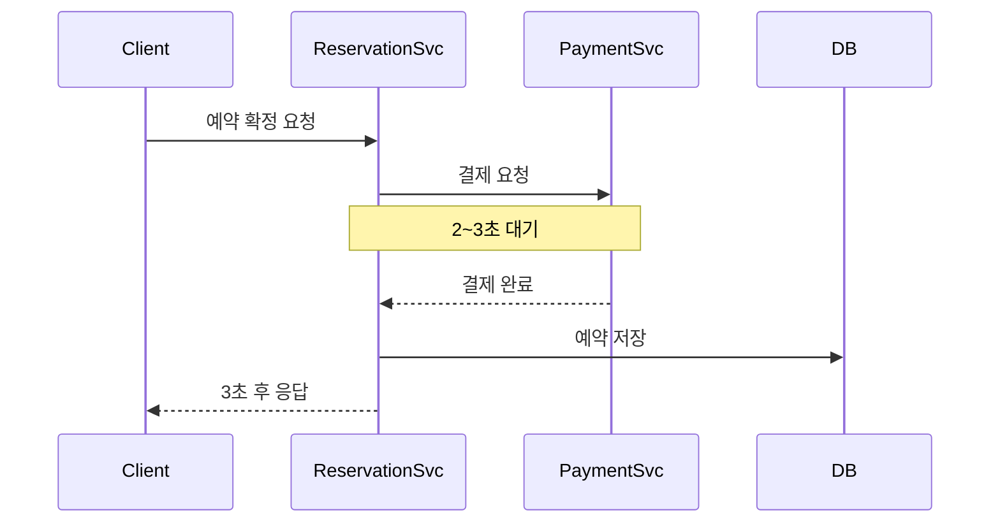
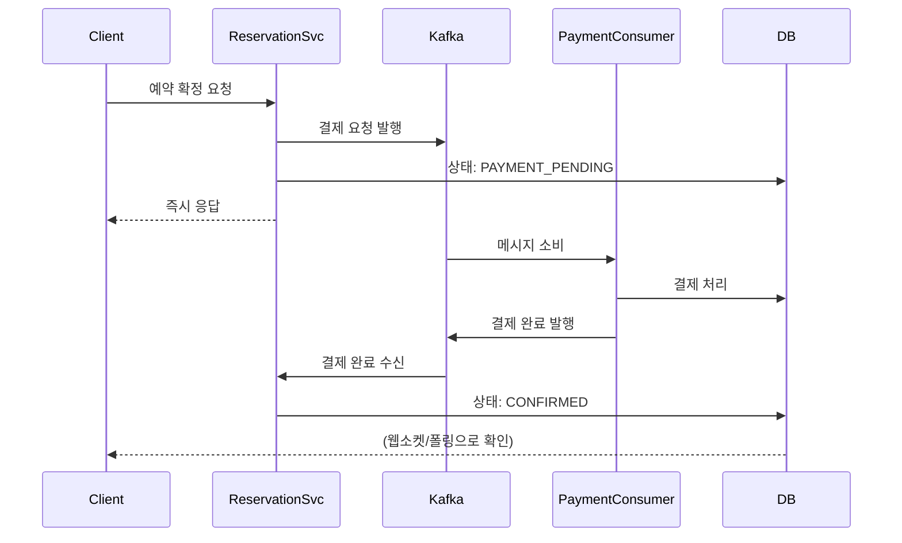

# 콘서트 예약 시스템 - Kafka 활용 대용량 트래픽 대응 설계서

> 작성자: 문예진
> 
> 작성일: 2025-11-28

---

## 1. 개요

### 1.1 배경

콘서트 티켓 예약 시스템은 특정 시간대에 트래픽이 급증하는 특성이 있습니다.

- 인기 콘서트 오픈 시: 평소 대비 **100~1000배** 트래픽
- 예: BTS 콘서트 오픈 시 1분 내 수십만 명 동시 접속

현재 시스템은 **동기 처리 + Redis 분산락** 기반으로 동작하고 있어, 피크 트래픽 시 병목이 발생할 수 있습니다.

### 1.2 목표

Kafka를 활용하여 대용량 트래픽에 대응하는 방안을 설계하고 구현합니다.

---

## 2. 대용량 트래픽 발생 지점 분석

### 2.1 시스템 전체 흐름

```
[사용자] 
    │
    ▼
[1. 대기열 진입] ─────────────────→ Redis
    │
    ▼
[2. 좌석 선택 (임시 배정)] ────────→ Redis 분산락 + MySQL
    │
    ▼
[3. 결제 처리] ───────────────────→ 동기 API 호출 병목
    │
    ▼
[4. 예약 확정] ───────────────────→ MySQL 트랜잭션
    │
    ▼
[5. 후처리 (랭킹, 데이터 플랫폼)] ─→ Spring Event + Kafka
```

### 2.2 트래픽 집중 지점

| 지점 | 발생 시점 | 예상 TPS | 현재 처리 방식 | 문제점 |
|------|----------|---------|---------------|------|
| 대기열 진입 | 오픈 직후 | 10,000+ | Redis | 양호 |
| 좌석 선택 | 대기열 통과 후 | 1,000+ | Redis 락 + MySQL | 락 경합 |
| **결제 처리** | 좌석 선택 후 | 500+ | **동기 API** | **병목** |
| 예약 확정 | 결제 후 | 500+ | MySQL | DB 부하 |

### 2.3 핵심 병목: 결제 처리

**현재 코드 분석:**

```java
// ReservationService.java
private ConfirmReservationResult executeConfirmReservation(...) {
    // 1. 예약 조회
    Reservation reservation = findAndValidateReservation(query.reservationId(), UserId.ofString(query.userId()));
    
    // 2. 결제 처리 - 동기 호출
    PaymentUseCase.BalanceResult paymentResult = paymentUseCase.pay(paymentCommand);
    
    // 3. 예약 확정
    reservation.confirm(confirmedAt);
    reservationRepository.save(reservation);
    
    // 4. 이벤트 발행
    eventPublisher.publishEvent(...);
}
```

**문제점:**
- 결제 API 응답 시간: 평균 200ms, 피크 시 **2~3초**
- 이 시간 동안 **스레드가 블로킹**됨
- 동시 500명 결제 → 500개 스레드 점유 → **서버 리소스 고갈**

---

## 3. Kafka를 사용하면 좋은 이유

### 3.1 문제 해결 관점

| 현재 문제 | Kafka 적용 후 |
|----------|-----------|
| 결제 완료까지 2~3초 대기 | **즉시 응답** (100ms 이내) |
| 스레드 블로킹으로 리소스 고갈 | **Non-blocking** 처리 |
| 결제 서버 장애 시 전체 장애 | **장애 격리** |
| 피크 시 결제 서버 과부하 | **트래픽 버퍼링** |

### 3.2 Kafka의 강점이 빛나는 이유

**1. 비동기 처리**
```
Before: [예약 서버] ──동기──→ [결제 서버] ──응답──→ [예약 서버]
                         (2~3초 대기)

After:  [예약 서버] ──발행──→ [Kafka] ──소비──→ [결제 Consumer]
             │                                        │
             └── 즉시 응답 (PAYMENT_PENDING)            └── 결제 처리
```

**2. 장애 격리**
```
결제 서버 장애 시:
- Before: 예약 전체 실패 
- After: 메시지는 Kafka에 보관, 복구 후 재처리 
```

**3. 피크 트래픽 흡수**
```
갑자기 1000건/초 요청이 들어와도:
- Kafka가 버퍼 역할
- Consumer는 자신의 속도로 처리
- 결제 서버 과부하 방지
```

### 3.3 적용 대상 선정

| 기능 | Kafka 적용 | 이유 |
|------|---|------|
| 대기열 | X | Redis Sorted Set이 더 적합 |
| 좌석 선택 | X | 즉시 응답 필요 (동기) |
| **결제 처리** | O | **비동기 처리 최적** |
| 랭킹 업데이트 | ⚠ | Spring Event로 충분 |
| 데이터 플랫폼 전송 | O | 이미 구현 완료 |

---

## 4. 비즈니스 시퀀스 다이어그램

### 4.1 Before: 현재 동기 처리



### 4.2 After: Kafka 비동기 처리



---

## 5. Kafka 구성

### 5.1 토픽 설계

| 토픽명 | 목적 | Key | Partitions | Retention |
|--------|------|-----|------------|-----------|
| `payment-requests` | 결제 요청 | userId | 10 | 7일 |
| `payment-results` | 결제 결과 | reservationId | 10 | 7일 |
| `data-platform-events` | 데이터 플랫폼 전송 | scheduleId | 6 | 30일 |

### 5.2 파티션 전략

**payment-requests:**
```
Key: userId
이유: 같은 사용자의 결제 요청은 순서 보장 필요 (중복 결제 방지)

Partition 수: 10
이유: Consumer 10대까지 병렬 처리 가능
```

**payment-results:**
```
Key: reservationId  
이유: 같은 예약의 결과는 순서 보장 필요 (상태 업데이트 순서)

Partition 수: 10
이유: 요청과 동일한 처리량 확보
```

### 5.3 메시지 포맷

```java
// 결제 요청 메시지
public record PaymentRequestMessage(
    String reservationId,
    String userId,
    Long amount,
    String idempotencyKey,
    Long scheduleId,
    Integer seatNumber,
    LocalDateTime requestedAt
) {}

// 결제 결과 메시지
public record PaymentResultMessage(
    String reservationId,
    String userId,
    PaymentStatus status, 
    Long balance,
    String failReason,    
    LocalDateTime processedAt
) {}
```

### 5.4 Consumer Group 설계

```
┌─────────────────────────────────────────────────────┐
│           payment-request-consumer-group            │
├─────────────────────────────────────────────────────┤
│  Consumer 1  │  Consumer 2  │  Consumer 3  │  ...   │
│  (P0, P1)    │  (P2, P3)    │  (P4, P5)    │        │
└─────────────────────────────────────────────────────┘

→ Consumer 수를 늘리면 처리량 증가 (최대 파티션 수까지)
```

---

## 6. 예약 상태 확장

### 6.1 상태 다이어그램

```
                    ┌───────────────────┐
                    │TEMPORARY_ASSIGNED │
                    └────────┬──────────┘
                             │ 결제 요청
                             V
                    ┌─────────────────┐
                    │ PAYMENT_PENDING │
                    └────────┬────────┘
                             │
              ┌──────────────┼──────────────┐
              │              │              │
              V              V              V
        ┌───────────┐  ┌──────────┐  ┌──────────┐
        │ CONFIRMED │  │  FAILED  │  │ EXPIRED  │
        └───────────┘  └──────────┘  └──────────┘
              │
              V
        ┌──────────┐
        │CANCELLED │
        └──────────┘
```

### 6.2 상태 enum 수정 (제안)

```java
public enum ReservationStatus {
    TEMPORARY_ASSIGNED,   // 임시 배정
    PAYMENT_PENDING,      // 결제 대기 중
    CONFIRMED,            // 확정
    PAYMENT_FAILED,       // 결제 실패
    CANCELLED,            // 취소
    EXPIRED               // 만료
}
```

---

## 7. 구현 방향

1. **Producer (예약 서비스)**
    - 예약 상태를 PAYMENT_PENDING으로 변경
    - Kafka로 결제 요청 발행
    - 즉시 응답 반환

2. **Payment Consumer**
    - 결제 요청 수신 → 결제 처리
    - 결제 결과를 Kafka로 발행

3. **Result Consumer**
    - 결제 결과 수신
    - 예약 상태 업데이트 (CONFIRMED / FAILED)
    - 좌석 점유 해제

---

## 8. 예외 처리

| 상황 | 처리 방법 |
|------|----------|
| 결제 타임아웃 | 스케줄러로 5분 초과 시 EXPIRED 처리 |
| 잔액 부족 | PAYMENT_FAILED 상태로 변경, 좌석 해제 |
| 메시지 처리 실패 | DLQ로 이동, 수동 확인 |

---

## 9. 기대 효과

### 9.1 성능 개선

| 지표 | Before | After | 개선율 |
|------|--------|-------|--------|
| 응답 시간 | 2~3초 | 100ms | **95% 단축** |
| 동시 처리량 | 500 TPS | 2000+ TPS | **4배 증가** |
| 스레드 점유 시간 | 3초 | 0.1초 | **97% 감소** |

### 9.2 안정성 개선

| 상황 | Before | After |
|------|--------|-------|
| 결제 서버 장애 | 전체 장애 | 메시지 보관, 복구 후 처리 |
| 피크 트래픽 | 서버 과부하 | Kafka 버퍼링 |
| 중복 요청 | 중복 결제 위험 | 멱등성 키로 방지 |

---

## 10. 결론

### 10.1 핵심 요약

```
문제: 결제 처리 동기 호출로 인한 응답 지연 및 리소스 고갈

해결: Kafka를 활용한 비동기 결제 처리
      - 즉시 응답 (PAYMENT_PENDING)
      - 백그라운드 결제 처리
      - 장애 격리 및 트래픽 버퍼링

효과: 응답 시간 95% 단축, 처리량 4배 증가
```

### 10.2 최종 아키텍처

```
[Client]
    │
    ▼
[API Gateway]
    │
    ▼
[예약 서비스] ──발행──→ [Kafka: payment-requests]
    │                           │
    │ 즉시 응답                   │ 소비
    │ (PAYMENT_PENDING)         ▼
    │                    [Payment Consumer]
    │                           │
    │                           │ 결제 처리
    │                           ▼
    │                    [Kafka: payment-results]
    │                           │
    │◀──────────────────────────┘ 상태 업데이트
    │
    ▼
[MySQL] + [Redis]
```

---
